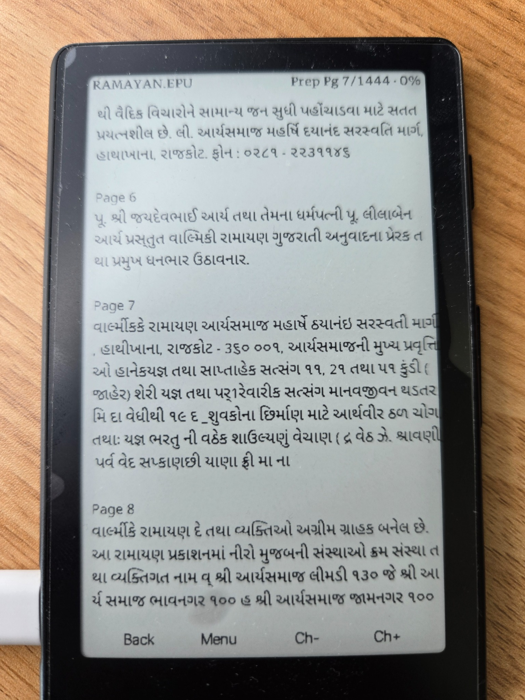
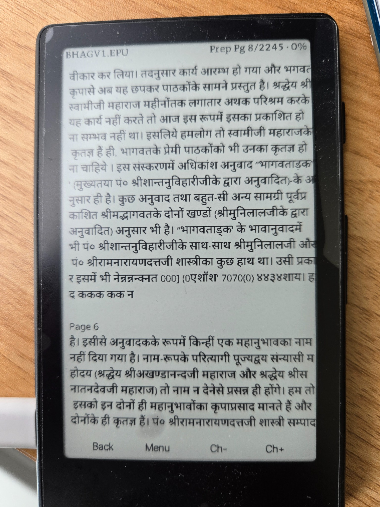
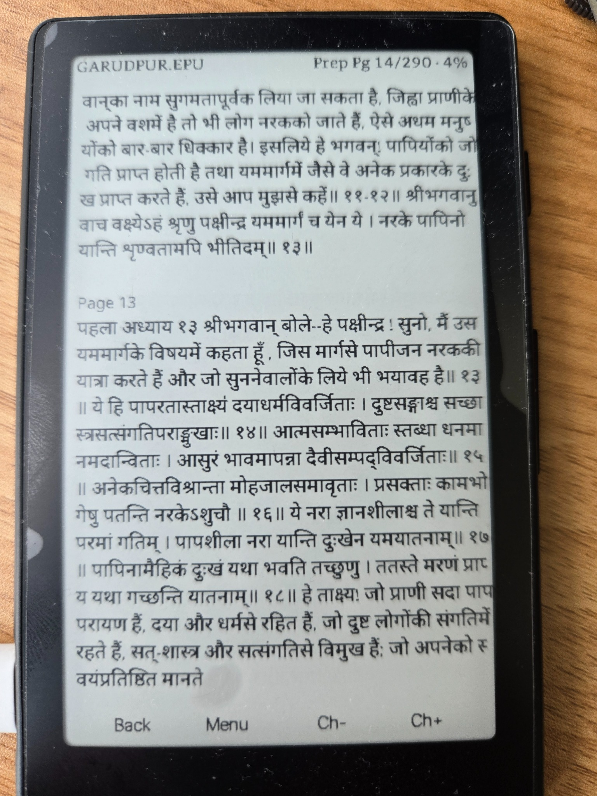

# Rustmix X4 Screenshots

This document provides screenshot references for Rustmix X4 firmware. The images show the main UI categories, reader workflows, host-prepared Hindi and Gujarati EPUB rendering, apps, network setup, system settings, and sleep-image behavior on the Xteink X4 device.

Use these screenshots in the README, user guide, GitHub release page, or project website. The images are stored in `screenshots/` and are optimized for GitHub display.

## Navigation

### Home dashboard

Main Rustmix launcher showing the major categories. Use this image near the README overview or first-run section.

## Reader

### Reader category

Reader entry screen for Books, Files, Recent, Bookmarks, and reading-related workflows.

### Reader main library view

Reader interface showing tabs and list navigation for available reading content.

### Reader files browser

File browser view for navigating SD-card folders and opening books.

### Reader books list

Books listing screen with discovered books and navigation footer.

### Recent books

Recent reading list screen showing recently opened books.

### Reader bookmarks

Bookmarks list screen for returning to saved reading positions.

### Host-prepared Gujarati EPUB rendering

Gujarati EPUB text rendered on the Xteink X4 from a page-local prepared cache. Complex Gujarati shaping is completed on the host computer before the cache is copied to the SD card.

### Host-prepared Hindi EPUB rendering

Hindi Devanagari EPUB text rendered from the prepared cache path, including shaped conjuncts and matra placement.

### Host-prepared Hindi and Sanskrit EPUB rendering

Mixed Hindi and Sanskrit Devanagari content rendered from a prepared EPUB cache with page-local VFN assets.

## Apps

### Dictionary

Dictionary app with on-screen keyboard and word lookup area.

### Calendar

Calendar app screen showing monthly view and event details.

### Productivity category

Productivity category listing SD-loaded or built-in productivity apps.

### Games category

Games category showing available starter games.

### Tools category

Tools category for utilities and helper apps.

## Network

### Network category

Network category showing Wi-Fi setup and Wi-Fi Transfer options.

### Wi-Fi setup

Wi-Fi setup screen for selecting profiles and entering credentials.

### Wi-Fi setup profile fields

Wi-Fi setup details screen showing profile/SSID/password fields and save actions.

### Wi-Fi password entry

On-device password entry keyboard for Wi-Fi setup.

### Wi-Fi Transfer status

Wi-Fi Transfer screen displaying the local transfer endpoint for browser-based SD-card access.

## System

### System category

System category with device, date/time, sleep, and related system settings.

### Device information

Device information screen showing firmware and hardware status details.

### Date & Time settings

Date and time settings screen showing sync and clock state controls.

## Sleep

### Sleep image settings

Sleep image information screen for the folder-only random image workflow. Rustmix selects valid BMP files from `/RUSTMIX/SLEEP`; the older static/text/no-redraw mode selector is no longer part of the release UI.

### Sleep image sample

Example sleep artwork displayed on the Xteink X4 e-ink screen.
